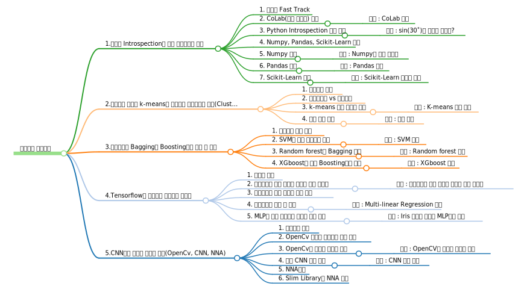

# 인공지능 핵심과목
* 강의 컨셉
  - 인공지능관련 5개의 주제를 10시간에 진행(옵니버스식이 아님, 과목간 연계성 있음.)

## 1.파이썬 Introspection과 분석 라이브러리 실습
* 인공지능 구현시 많이 사용되는 Python언어의 사용 노하우 및 공통적으로 사용되는 라이브러리(Numpy, Pandas, Scikit-Learn)에 대한 소개와 실습을 진행합니다.
### 1. 파이썬 Fast Track
### 2. CoLab(혹은 자사앱) 접근
#### 실습 : CoLab 사용
### 3. Python Introspection 기법 실습
#### 실습 : sin(30˚)를 구하고 싶다면?
### 4. Numpy, Pandas, Scikit-Learn 이해
### 5. Numpy 실습
#### 실습 : Numpy로 배열 곱하기
### 6. Pandas 실습
#### 실습 : Pandas 기초
### 7. Scikit-Learn 실습
#### 실습 : Scikit-Learn 데이터 로딩

## 2.기계학습 개요와 k-means로 이해하는 비지도학습 방법(Clustering 기법)
* 기계학습은 통계적 모델에 기반한 전통적인 기계학습과 인공신경망 기반의 딥러닝이 있고, 본 과정에서는 전통적인 기계학습에 대한 개요와 비지도 학습에 대한 실습을 진행합니다.
### 1. 기계학습 개요
### 2. 비지도학습 vs 지도학습
### 3. k-means 모델 만들기 실습
#### 실습 : K-means 모델 구현
### 4. 모델 평가 실습
#### 실습 : 모델 평가

## 3.지도학습과 Bagging과 Boosting기법 이해 및 실습
* 전통적인 기계학습의 지도학습과 이를 발전시킨 Boosting기법과 Bagging기법을 순차적으로 이론과 실습형태로 진행합니다.
### 1. 지도학습 모델 소개
### 2. SVM을 통한 지도학습 실습
#### 실습 : SVM 구현
### 3. Random forest로 Bagging 구현
#### 실습 : Random forest 구현
### 4. XGboost를 통한 Boosting기법 실습
#### 실습 : XGboost 구현

## 4.Tensorflow로 이해하고 실습하는 딥러닝
* 딥러닝 개념에 대한 이해를 통해 용어를 숙지하고 이렇게 이해한 용어를 기반으로 Tensorflow 라이브러리 사용법을 실습을 통해 진행합니다.
### 1. 딥러닝 개요
### 2. 시뮬레이터 통한 딥러닝 개념과 용어 익히기
#### 실습 : 시뮬레이터 통한 딥러닝 개념과 용어 익히기
### 3. 시뮬레이터 통한 딥러닝 과정 이해
### 4. 옵티마이저 이해 및 실습
#### 실습 : Multi-linear Regression 구현
### 5. MLP를 통한 지도학습 딥러닝 모델 구현
#### 실습 : Iris 데이터 셋으로 MLP모델 학습

## 5.CNN통한 이미지 데이터 분석(OpenCv, CNN, NNA)
* 전통적인 기계학습보다 높은 성능을 보여주는 딥러닝기반 시각인지 과목을 실전에 바로 적용할 수 있도록 이미지 전처리부터 이미지 분류 모델 적용까지의 실습을 진행합니다.
### 1. 시각인지 개요
### 2. OpenCv 개요와 시각인지 분야 설명
### 3. OpenCv로 이미지 전처리 실습
#### 실습 : OpenCV로 이미지 전처리 하기
### 4. 기초 CNN 모델 구현
#### 실습 : CNN 모델 구현
### 5. NNA소개
### 6. Slim Library의 NNA 모듈

# Made by
* Steve J.South [NamJungGu] <nowage@gmail.com>
